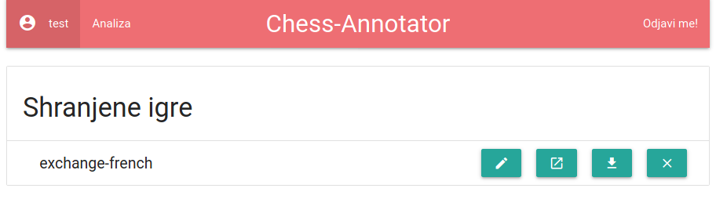
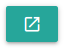
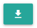
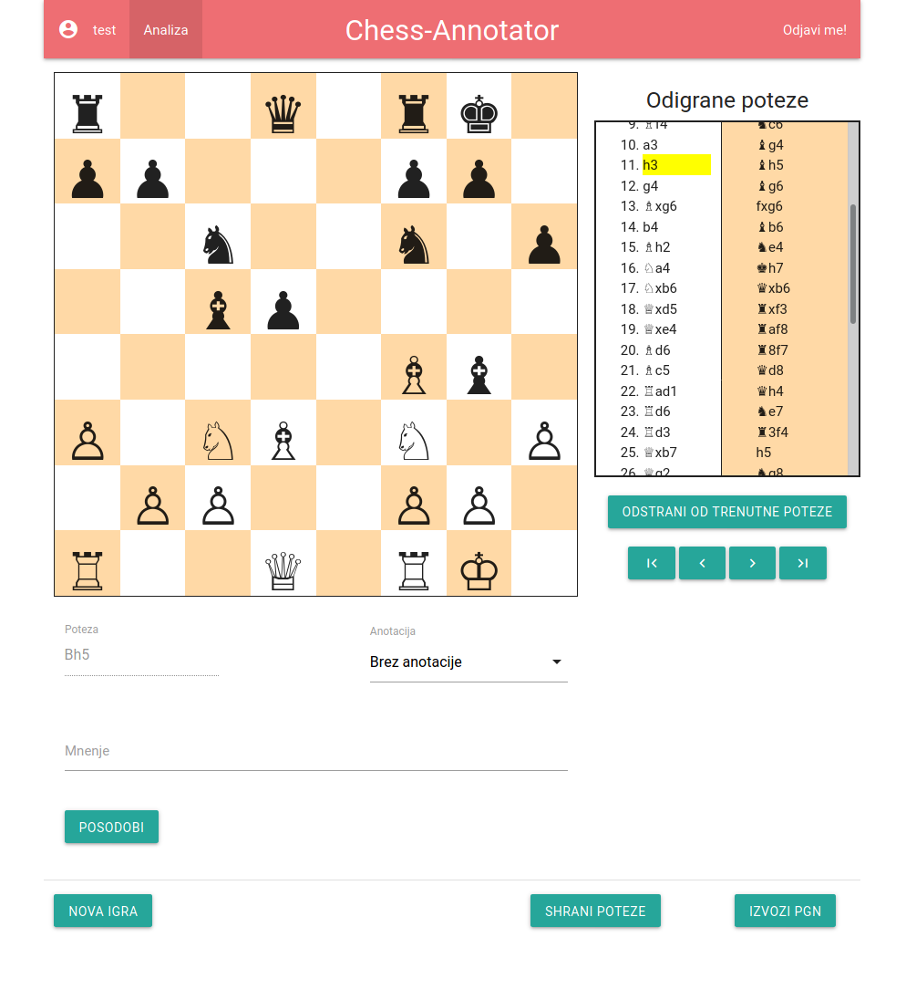

# Chess-Annotator
Chess-Annotator je program za anotacijo šahovskih partij. Omogoča lokalno shranjevanje in izvoz za dolgoročno shranjevanje, usklajeno s [PGN standardom](https://ia802908.us.archive.org/26/items/pgn-standard-1994-03-12/PGN_standard_1994-03-12.txt).

## Kako zagnati program
Najprej se premaknemo v projektno mapo z ukazom `cd Chess-Annotator`. Nato zaženemo lokalni strežnik
z ukazom `python .` oziroma `python __main__.py`.

Strežnik posluša na naslovu [127.0.0.1:8080](http://127.0.0.1:8080).

## Opis delovanja
### Stran uporabnika
Po prijavi smo preusmerjeni na stran uporabnika, kjer so predstavljene shranjene igre.

Opazimo 4 gumbe na desni strani. Vsak služi svojemu namenu:
Gumb | Pomen
-----|------
 | Preimenuj datoteko
 | Poženi v zavihku 'Analiza'
 | Prenesi na svoj disk
 | Izbriši igro

### Analiza
Na zavihku 'Analiza' se nahaja glavni del programa. Tukaj vnašamo poteze, pišemo mnenje o opravljeni potezi, lahko shranimo poteze, in morda najbolj pomembno: lahko izvozimo PGN, ki ga bodo prepoznali ostali temu namenjeni programi.

Poteze vnašamo v algebrajski notaciji, sproti se bodo prikazale legalne poteze, ki ustrezajo trenutno vnesenim znakom. Ob strani so prikazane trenutno odigrane poteze, ter gumbi za premikanje po seznamu. Z rumeno je označena zadnja poteza, ki je bila odigrana.

Za vnos nove poteze se je potrebno premakniti do konca odigranih potez, kar najlažje storimo s klikom na skrajno desni navigacijski gumb pod njimi.

## Nadaljne delo
* premik po seznamu s klikom na potezo
* označevanje polj šahovnice
* možno obračanje šahovnice
* nazoren prikaz kdo je na potezi
* igranje proti računalniku
* igranje proti drugim uporabnikom
* več tem / izbir barv
* nazorno podajanje povratnih informacij (napačno geslo, nepravilna notacija ipd.)
* premikanje figur z računalniško miško
* označevanje zadnje poteze tudi na šahovnici (npr. puščica ali obarvani kvadrati)
* dodajanje svojih značk v izvožen PGN in k shranjenim potezam
* uvažanje PGN s strani uporabnika
* ...
